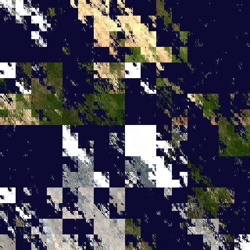

fractalprojection
=================

Performs a "fractal" projection that `@psysal` describes [here](https://twitter.com/psysal/status/717541193702244352).

The end result is just this image below, but maybe you can do something else with this code?

Requirements
------------

1. Python 3.3+
